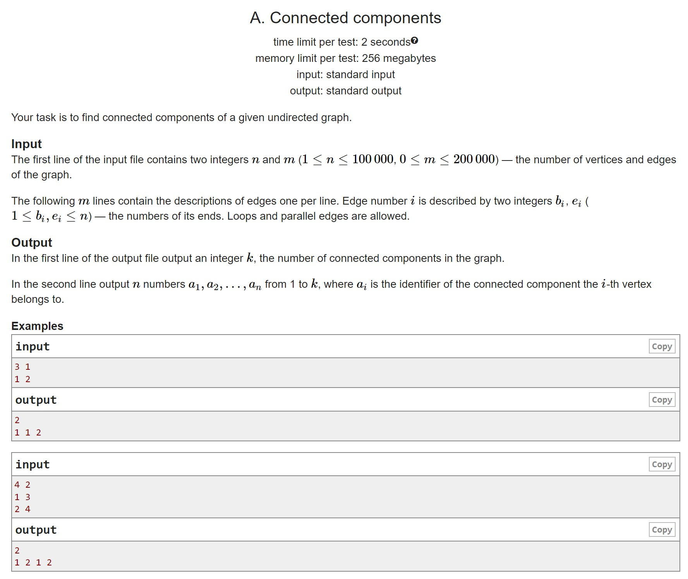
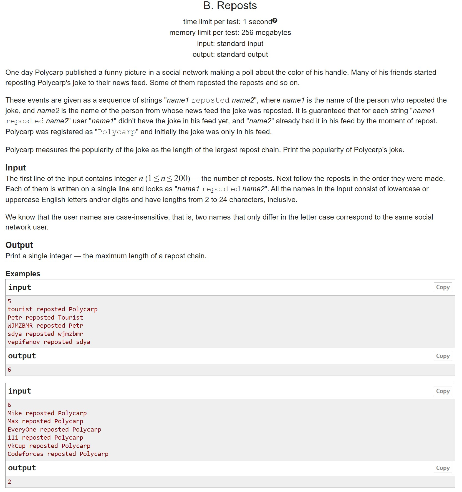
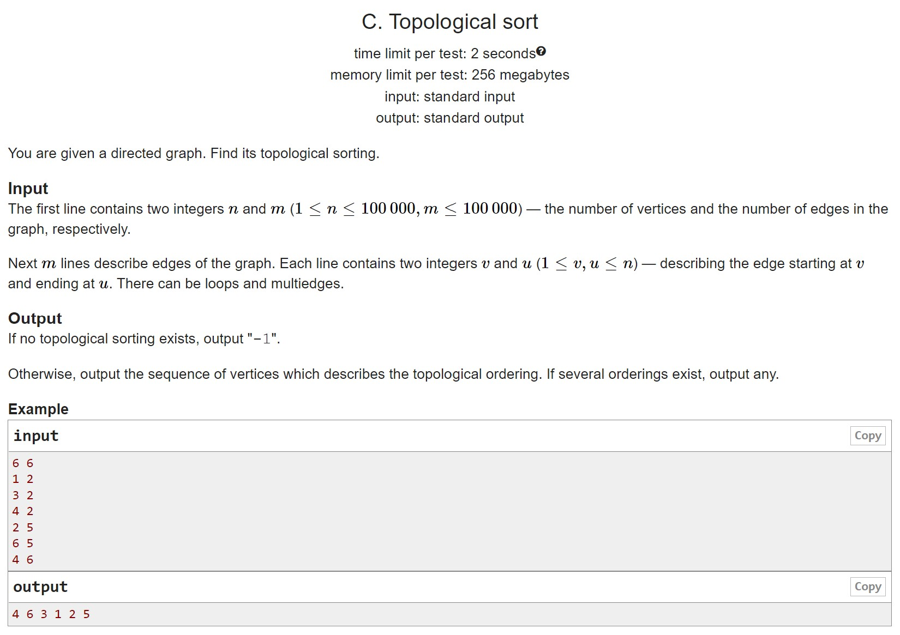
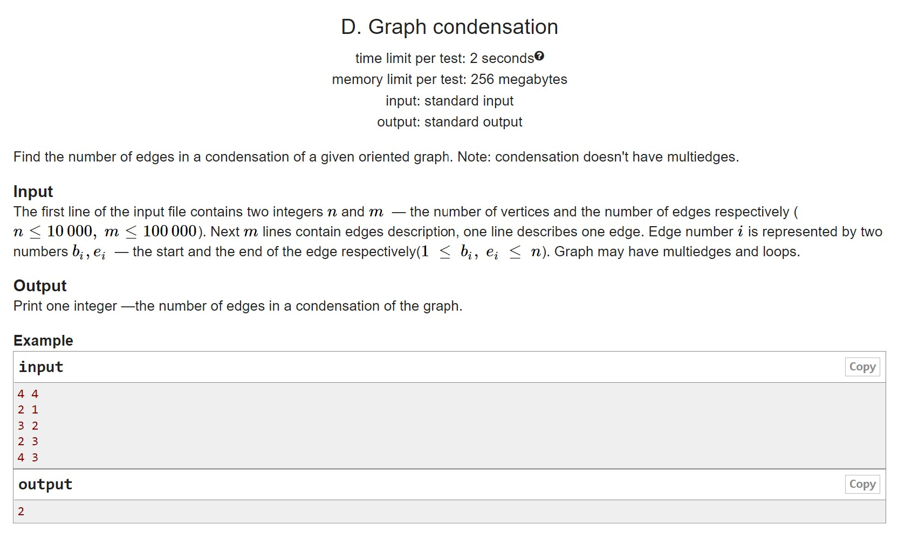
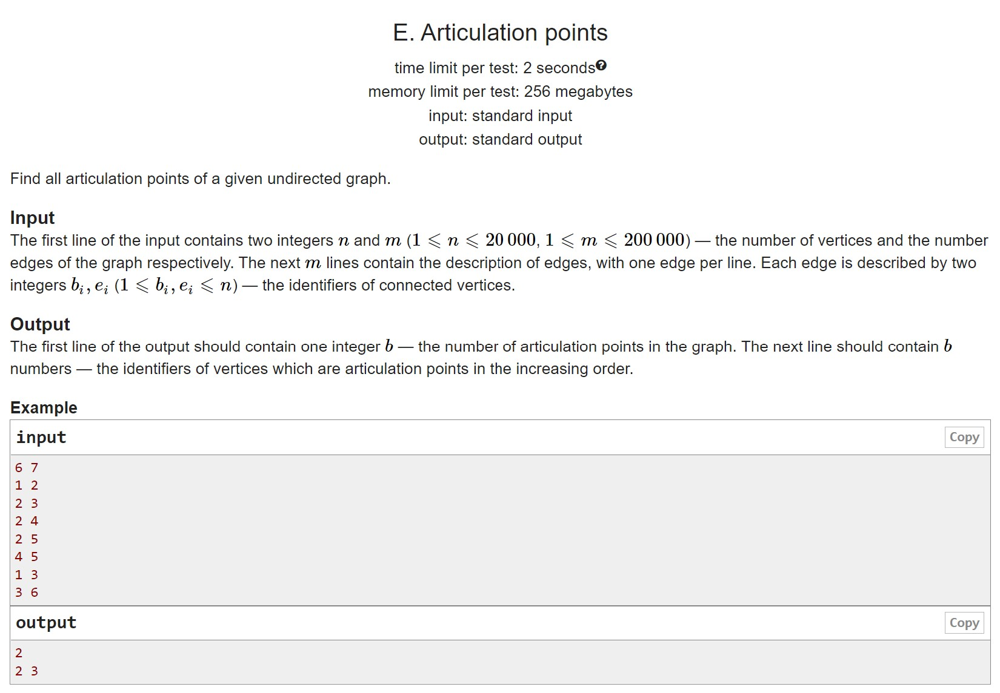

# HW10

A. Components of connectivity As in the lecture:)
B. Reposts Application of search in depth
C. Topological sorting As in lecture:)
D. Count condensation As in lecture:)
E. Junction points Same as bridges, but more scary:)

## A

## B

## C

## D

## E

