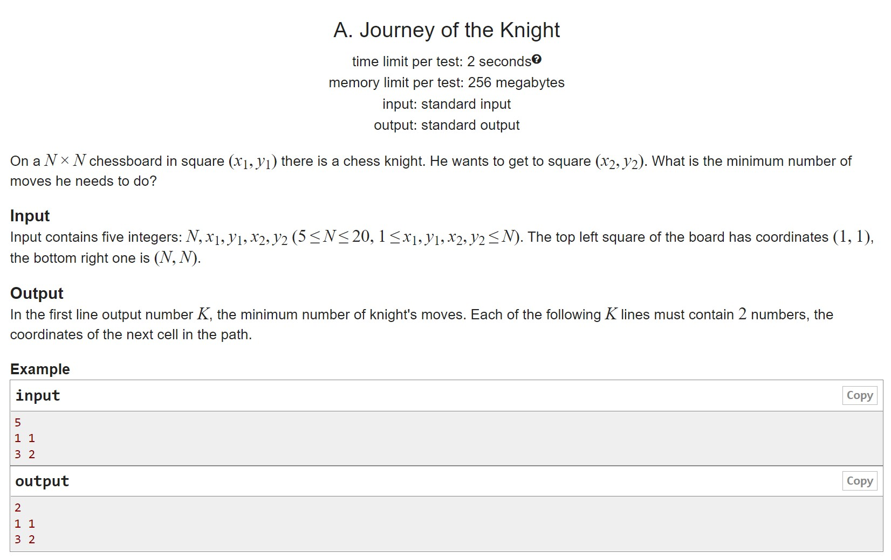

# HW11

A. Adventures of the Chess Horse Somewhere there is a hidden graph, also unweighted, you can try to run a traversal of the width
B. The shortest path We check the deikstra on the priority queue
C. Negative weight loop Here we have to find a loop of negative weight using Floyd's algorithm
D. Shortest Paths My favorite Ford-Belman shortest paths problem is your time! Additionally you need to realize what "there is a path between vertices, but no shortest path" means.

## A

## B

## C

## D

