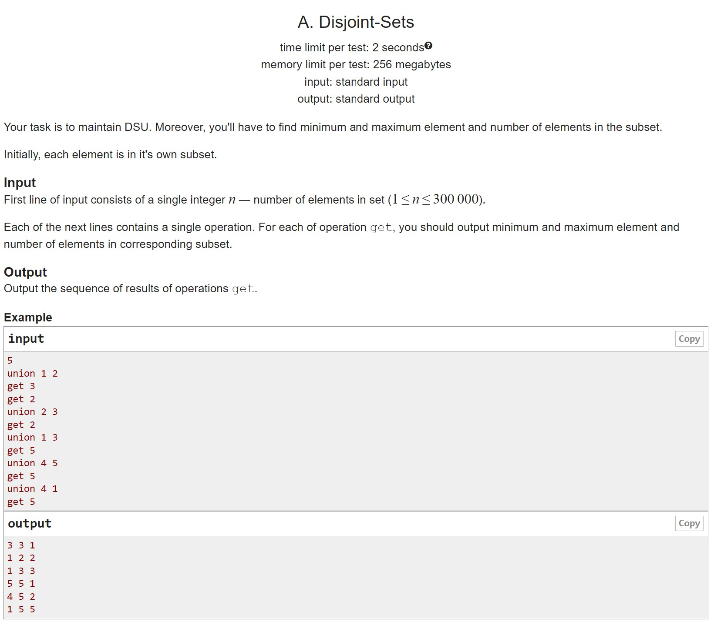
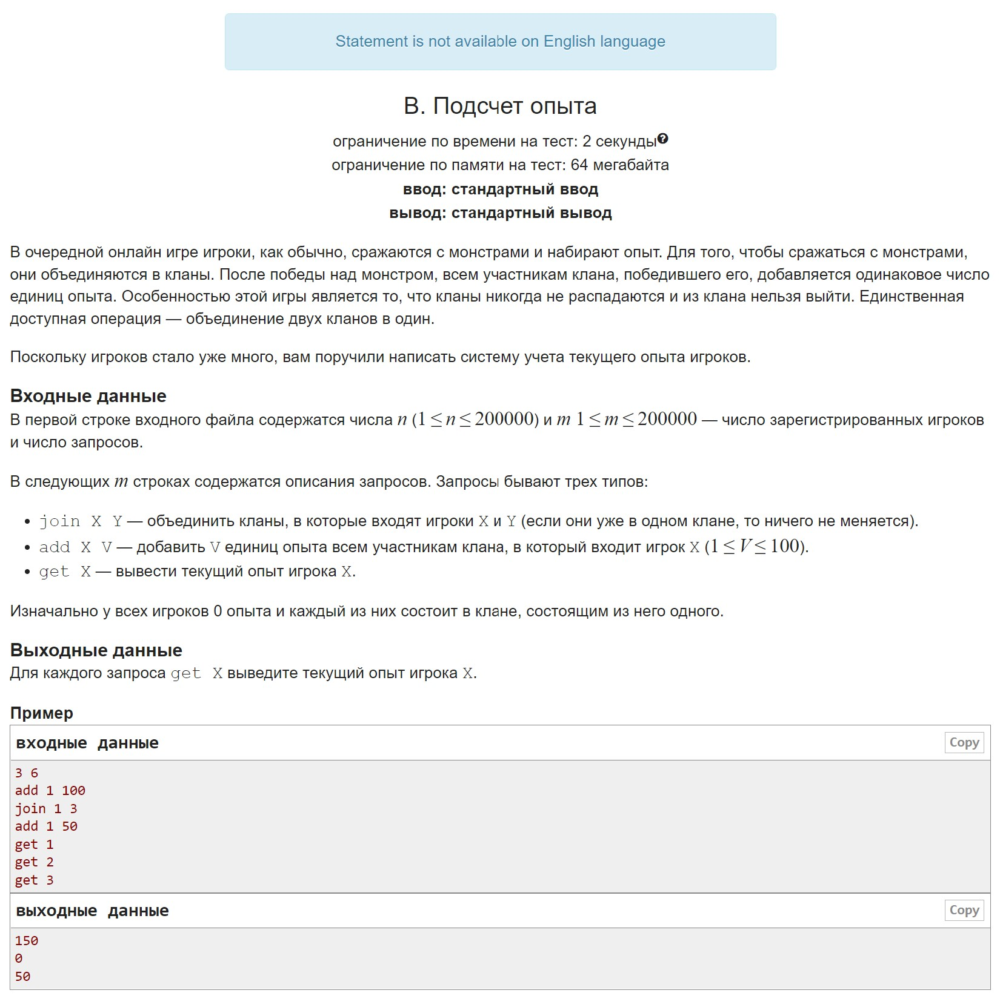
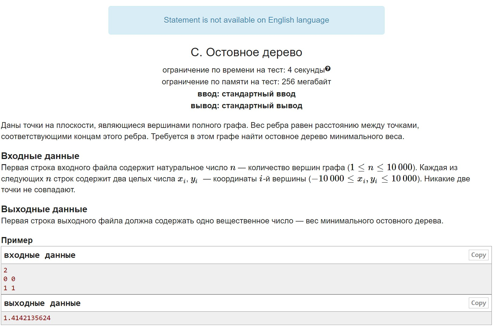
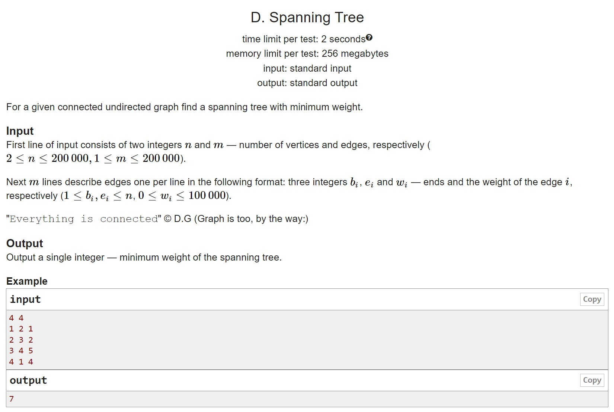
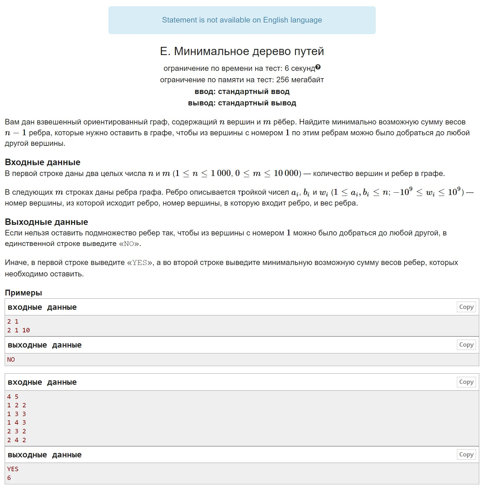

# HW12

A. A system of non-intersecting sets Training Disjoint-set data structure, don't forget both heuristics

B. Experience counting A fun task to apply Disjoint-set data structure, don't forget both heuristics

C. Hollow tree See complete graph, write Prima

D. Spanning Tree 2 Let's write Kruskal to train it, plus it's very simple

E. Minimal path tree Oh, oriented graph, release two Chinese!

## A

## B

## C

## D

## E

