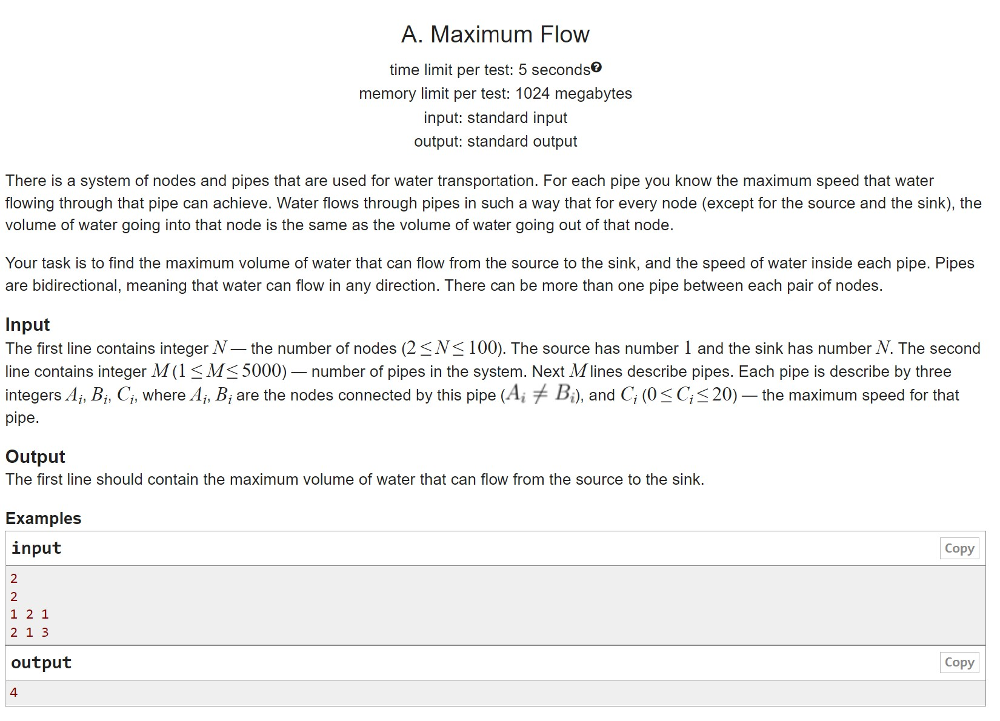
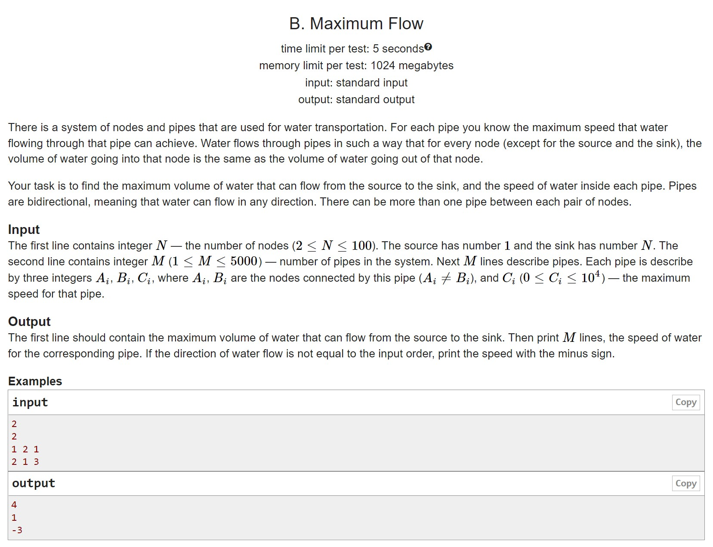
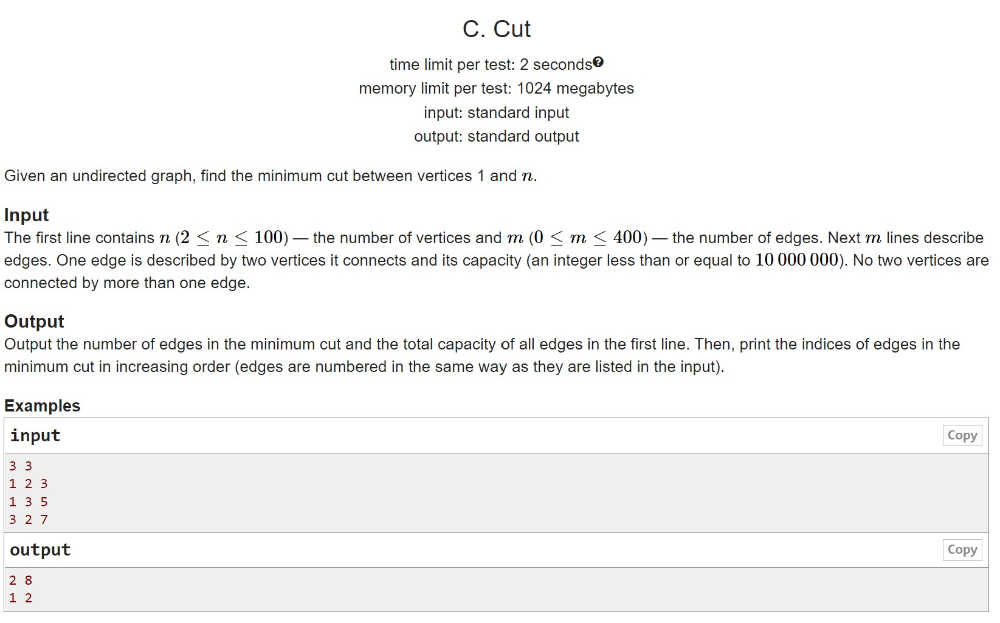
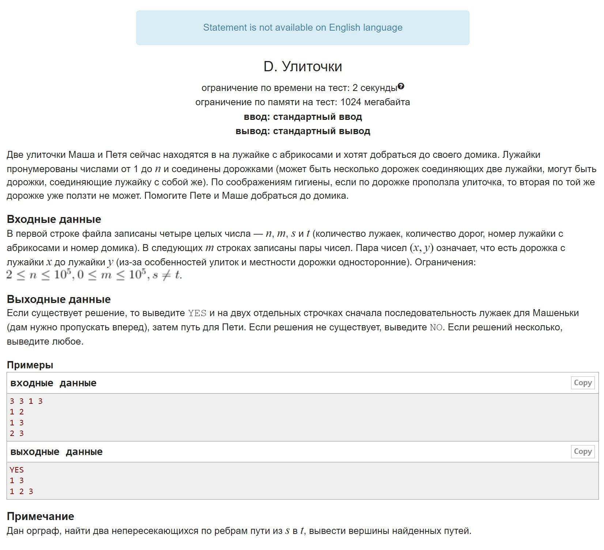
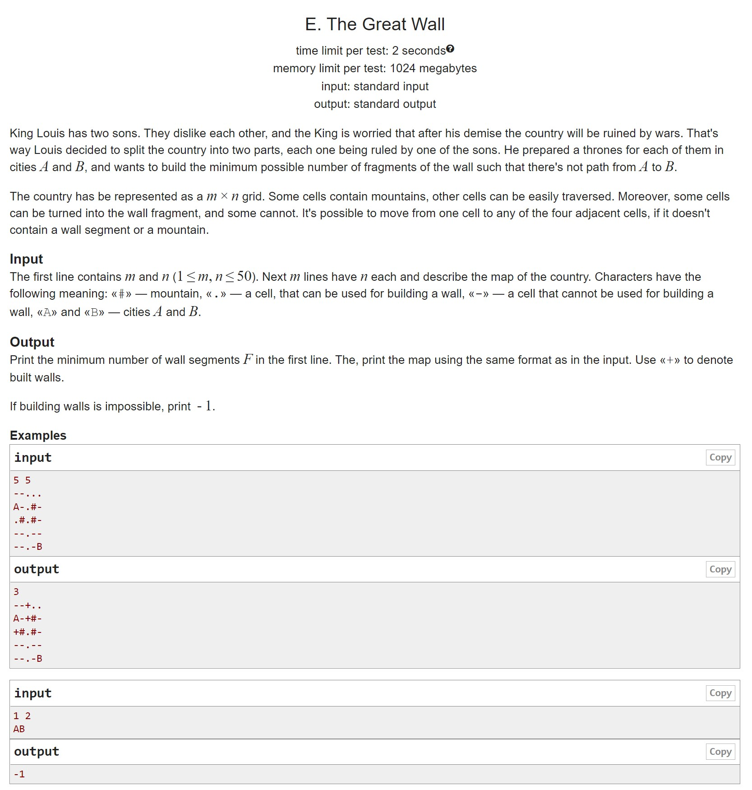

# HW13

A. Very simple flow We practice writing a flow, you can use Ford-Falkerson and even without scaling
B. Simple flow Same thing, but Edmonds-Carp with scaling
C. Slit Know how to look for a flow, know how to look for a slit
D. Snails The problem is reduced to finding non-intersecting paths
E. The Great Wall No comment here

## A

## B

## C

## D

## E

