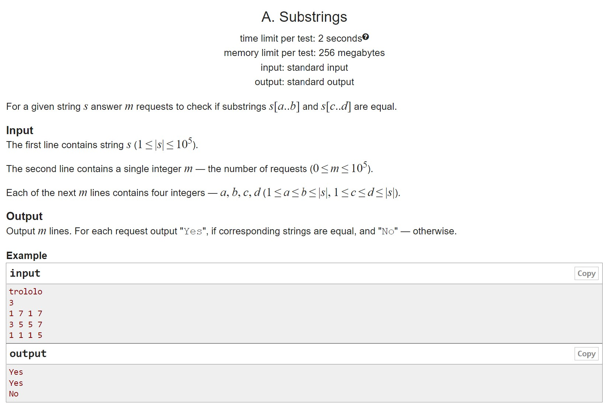

# HW14

A. Substring comparison A good training problem for polynomial Hash

B. Z-function Hmm. What's to be done here?

C. Quick search for substring in string Prefix function + KMP

D. Bohr Dictionary Application

E. Substrings-3 Heard such a task was given at one time in interviews, you can write a suffix array, or you can use Hash and something for the logarithm to do the beauty)

## A

## B

## C

## D

## E

