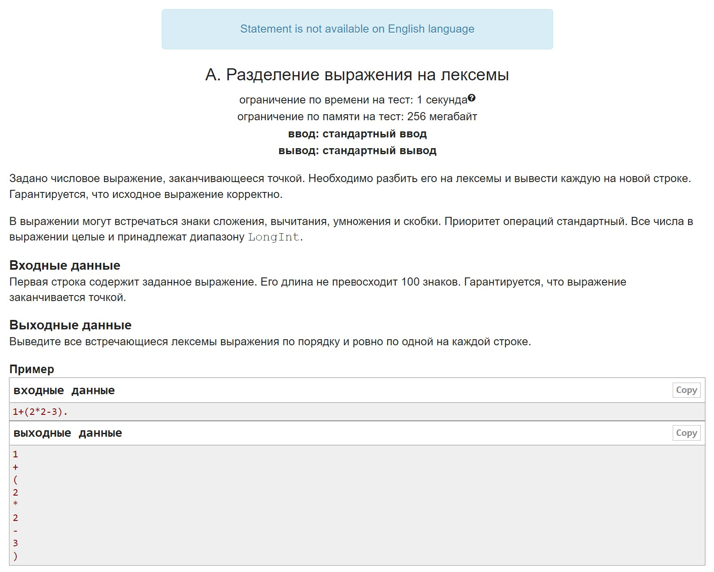
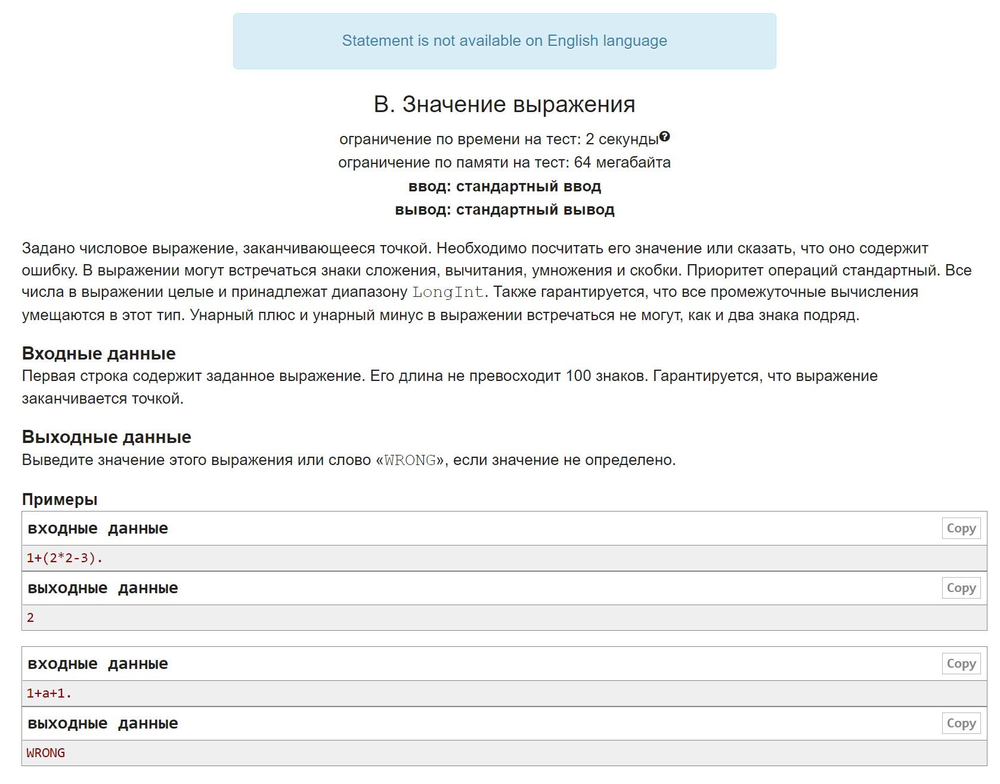
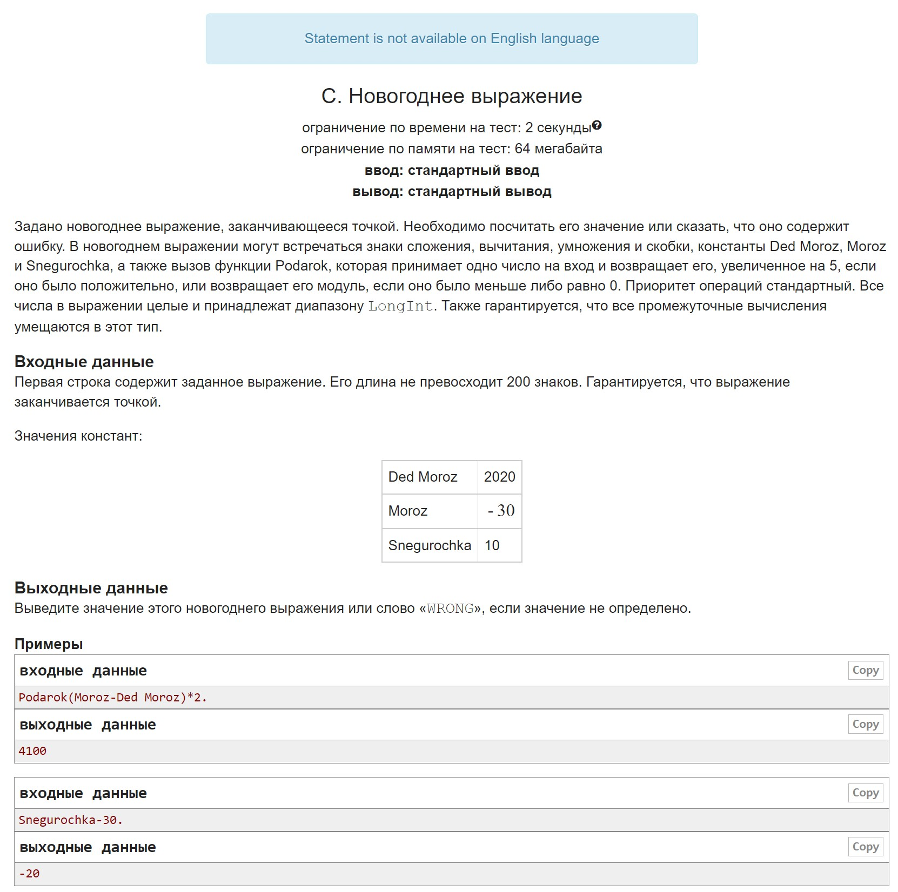
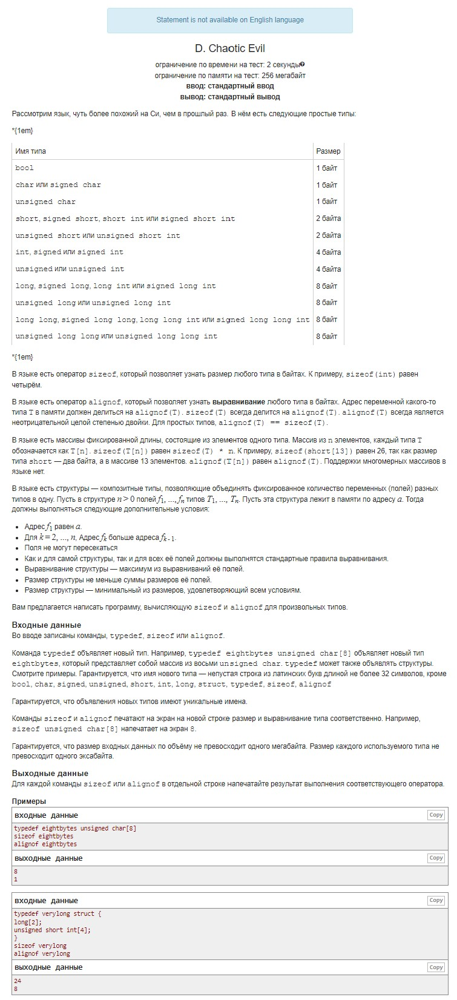

# HW15

Requirements for homework:
It is forbidden to use built-in parsers, regexp-types, functions like eval() and replace() to cheat
Lexer and Parser must be placed in separate classes
The lexer must be initialized with an input string and have a nextToken/nextLexem method to be used by the Parser.
Parser should use lexer and not appeal to symbols directly
Comments:
It's better to implement tokens through enum
The parse tree is a separate class with evaluate()

A. Dividing into tokens Learning to write Lexer
B. Value of the expression Using a lexer, we add a parser, get a parse tree from which we compute the value
C. Expanding the grammar with three variables and one new function, and the rest is the same as in B
D. Chaotic evil A task for understanding the language, inventing the grammar, and then processing the text in this language

## A

## B

## C

## D

