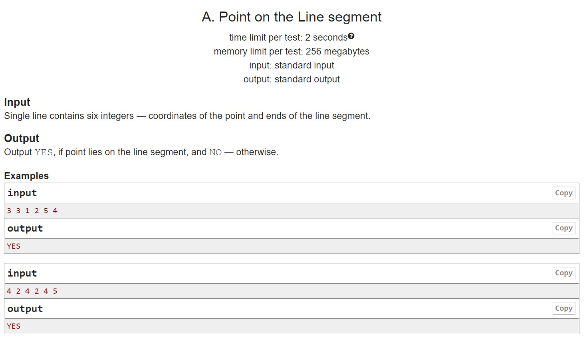
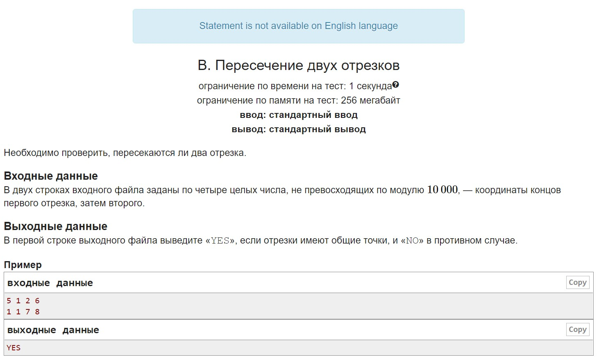
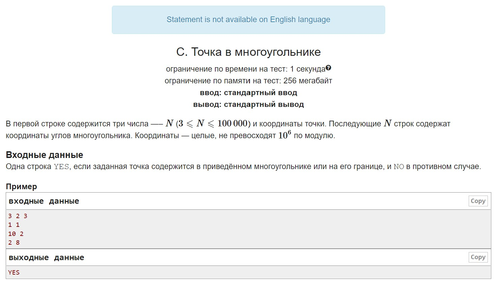
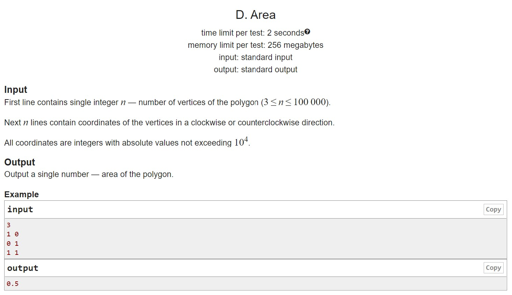
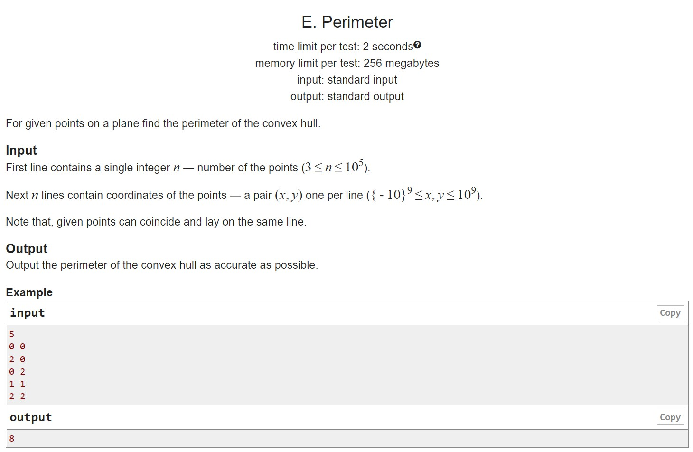

# HW16

Requirements for homework:
Data structures for a vector and a point must be implemented through OOP principles
All operations: methods
The lecture spent a great amount of time on this.
A. Attributing a point to a segment Learning to write classes and use products
B. Intersection of two segments If you use the equation of a line in this problem, something went wrong
C. A point in a polygon You can use a ray, you can use polar angles, as an exercise the ray is more useful
D. Area of a polygon Through the oriented area of triangles
E. Perimeter of a convex hull Any of the methods discussed, build a convex hull, and find the perimeter easily

## A

## B

## C

## D

## E

