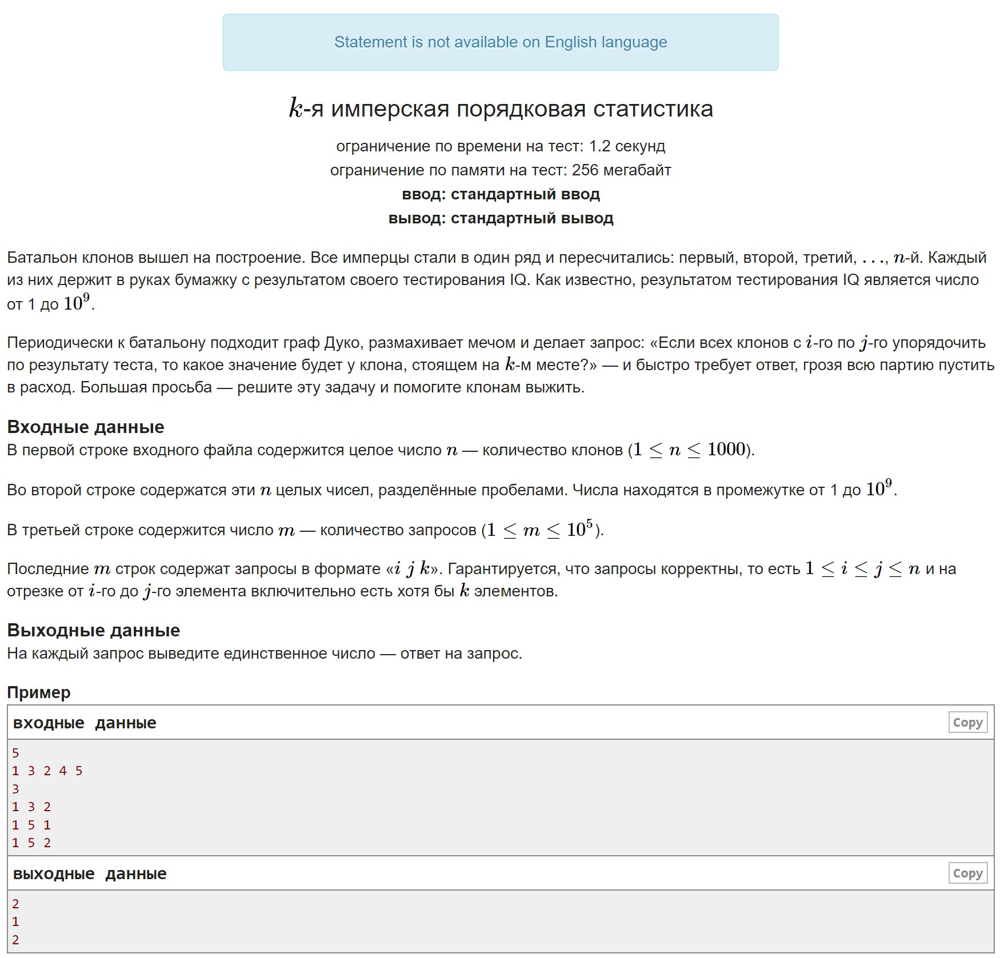

# HW2

A. $k$th imperial ordinal statistic Implement a search for the kth ordinal statistic. Note the file I/O in this problem.

B. Counting sort It's probably pretty clear what to do here:)

C. Numerical sorting Here too.

D. Grisha after the disco They say that by counting sort, you can check strings for anagrams. This idea may help in this task.

## A

## B

## C

## D

