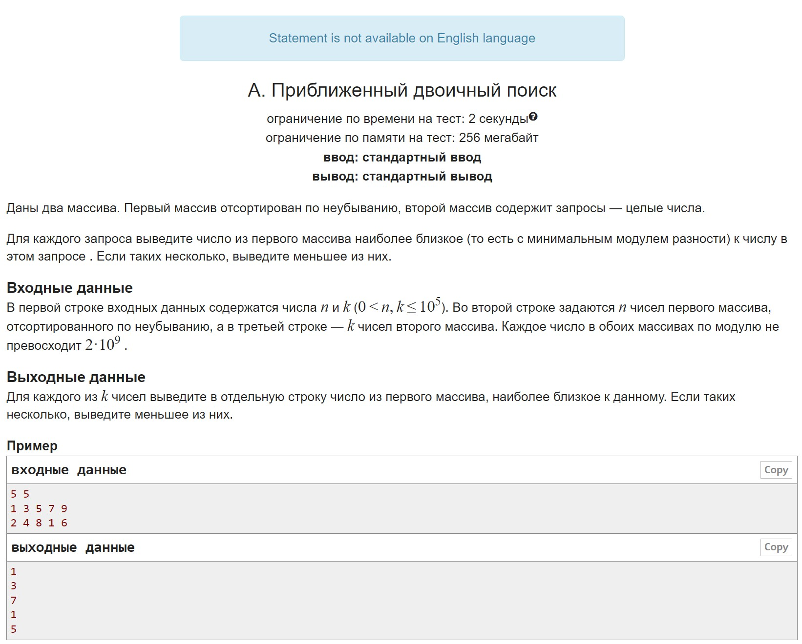
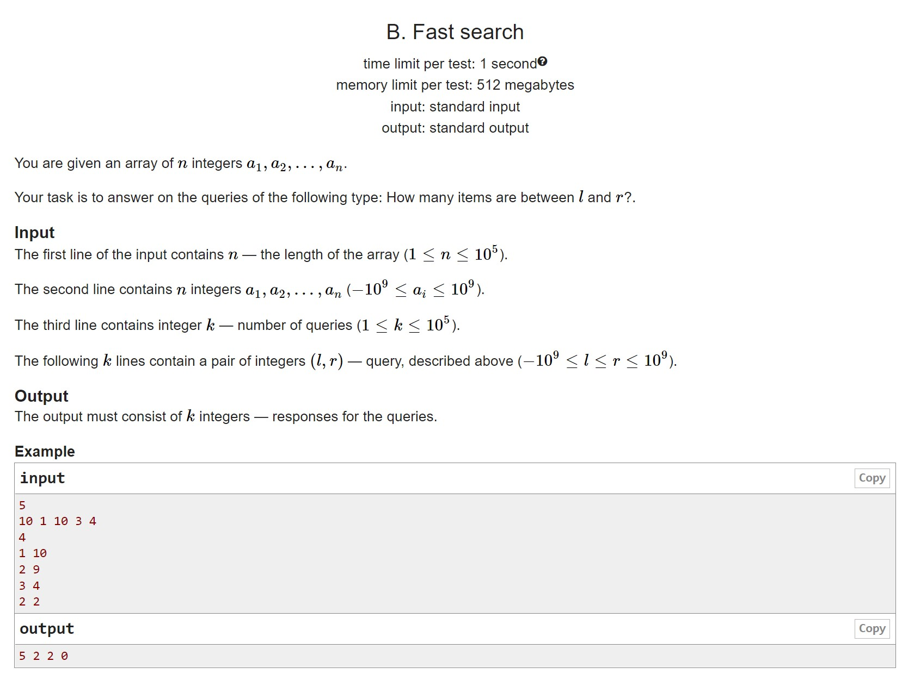
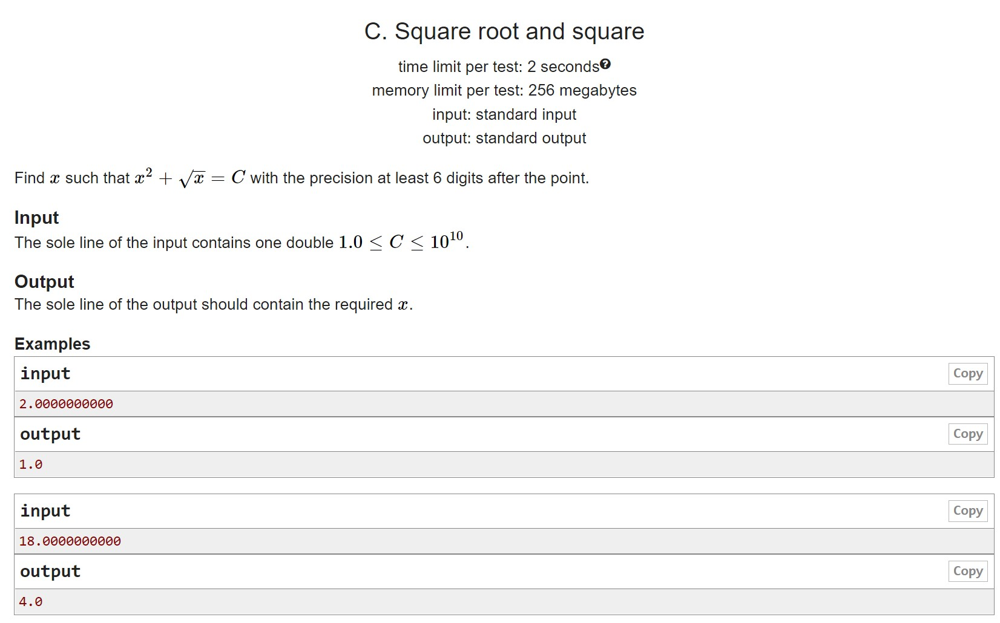
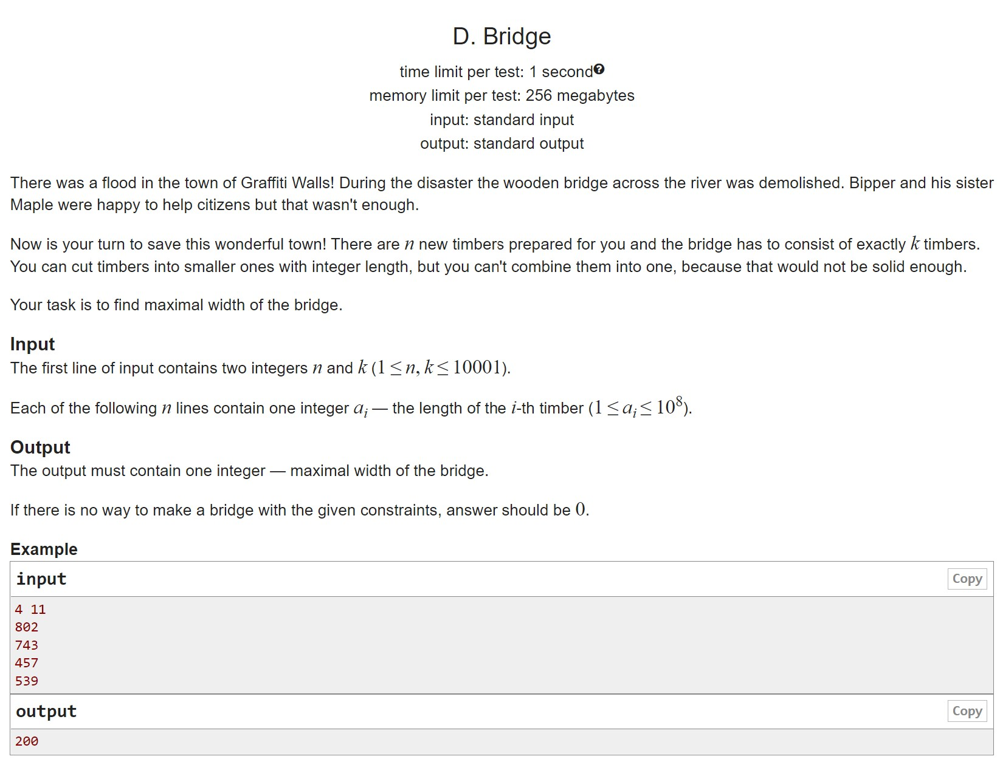
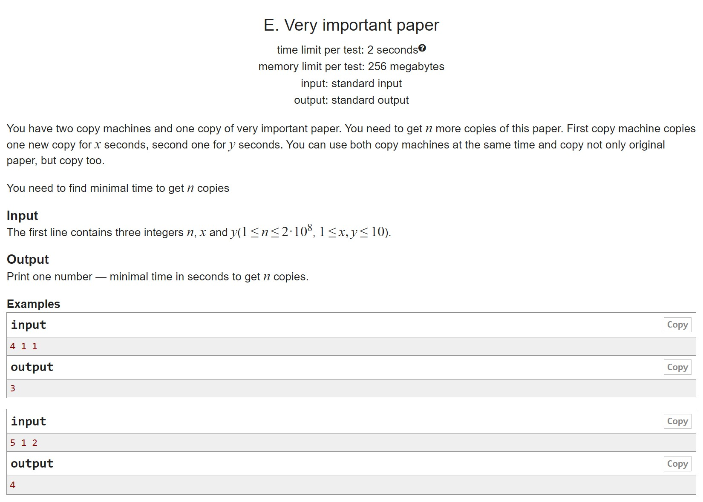
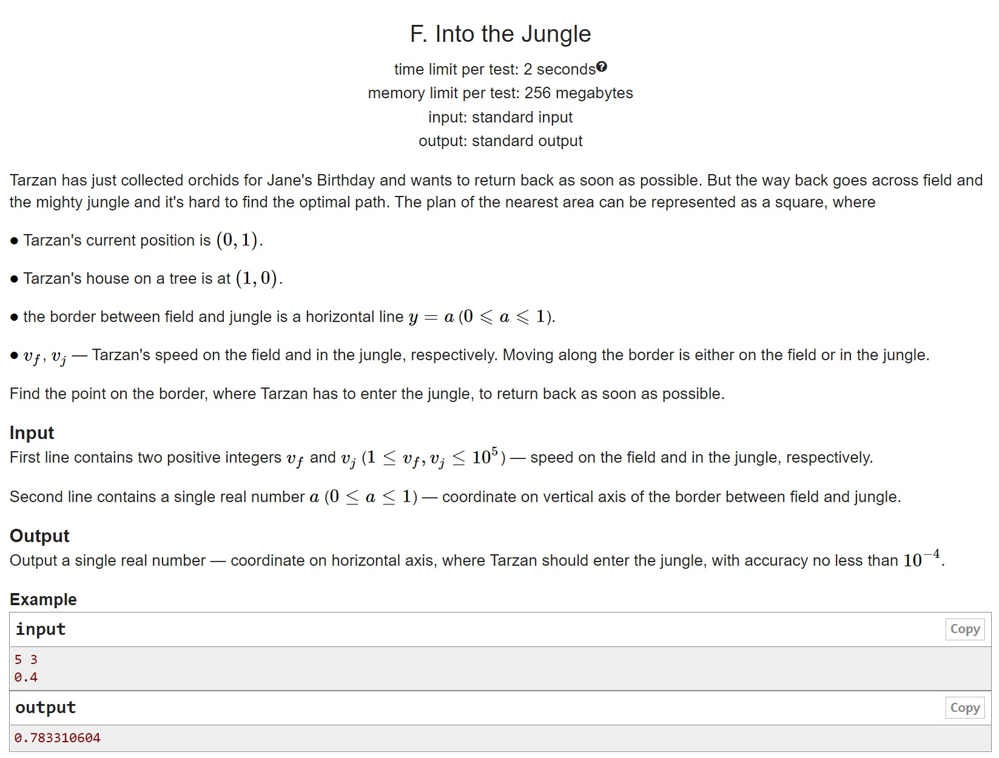

# HW3

A. Approximate Binary Search Hmm... what should we do here? How about writing a binary search?

B. Quick array search There seems to be the same here.

C. The square root and the square square And here's some kind of real function, I wonder if it's monotonic or convex?

D. Ropes A binary search on the answer.

E. Very easy problem Here too (even if you derive an analytic formula, we won't accept it)

F. Glade of firewood Okay, and there's some function hidden here, too.

## A

## B

## C

## D

## E

## F

