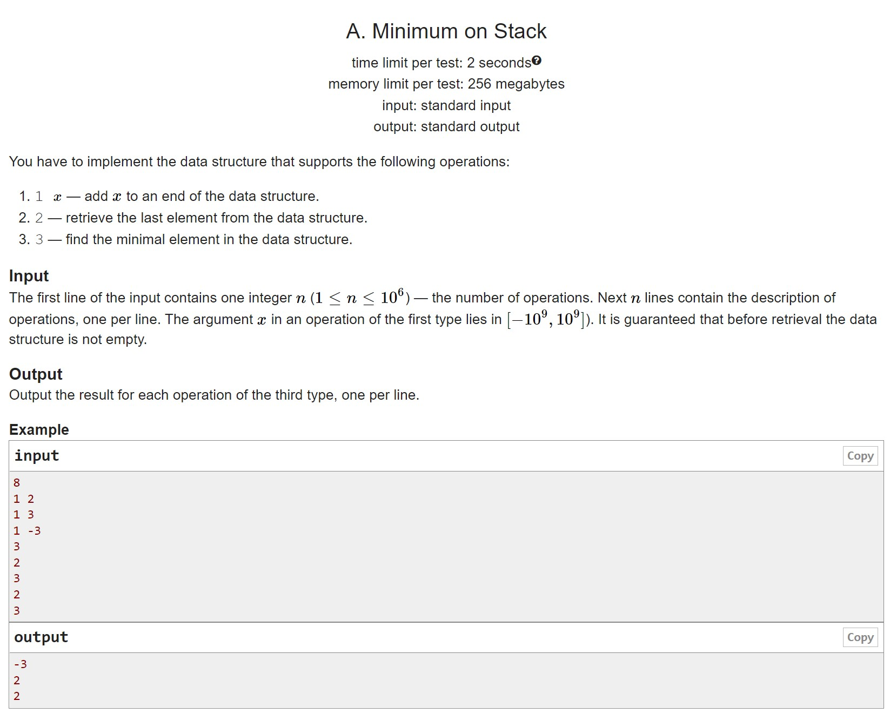
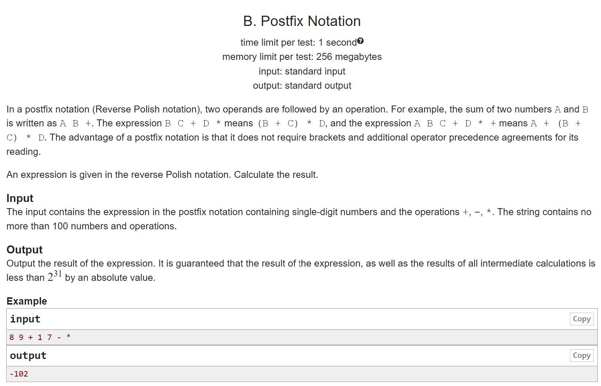
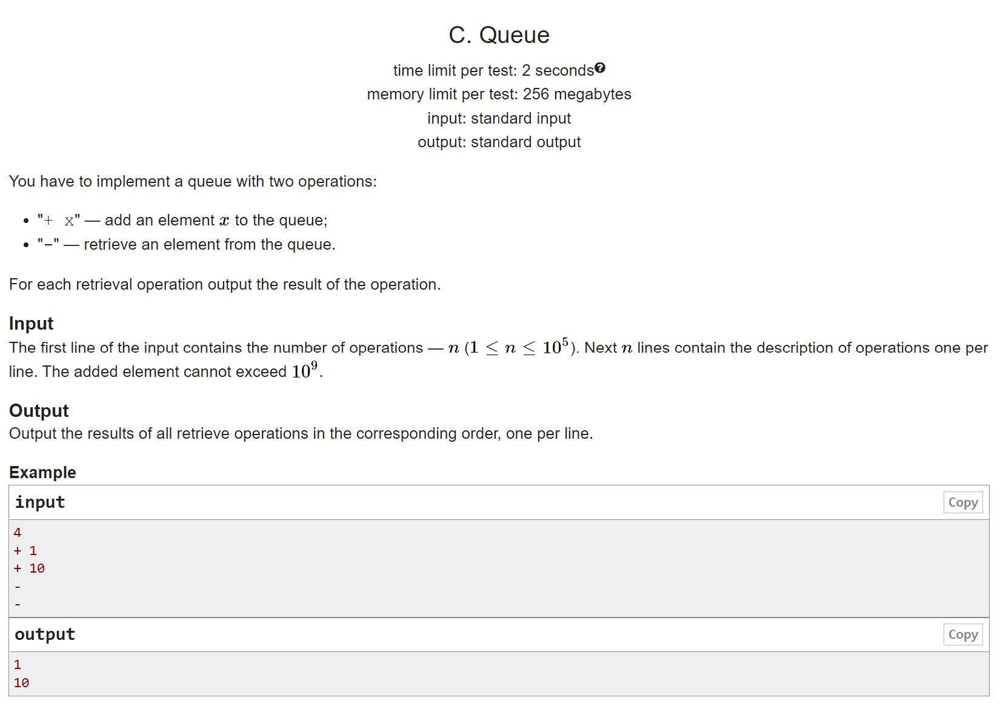
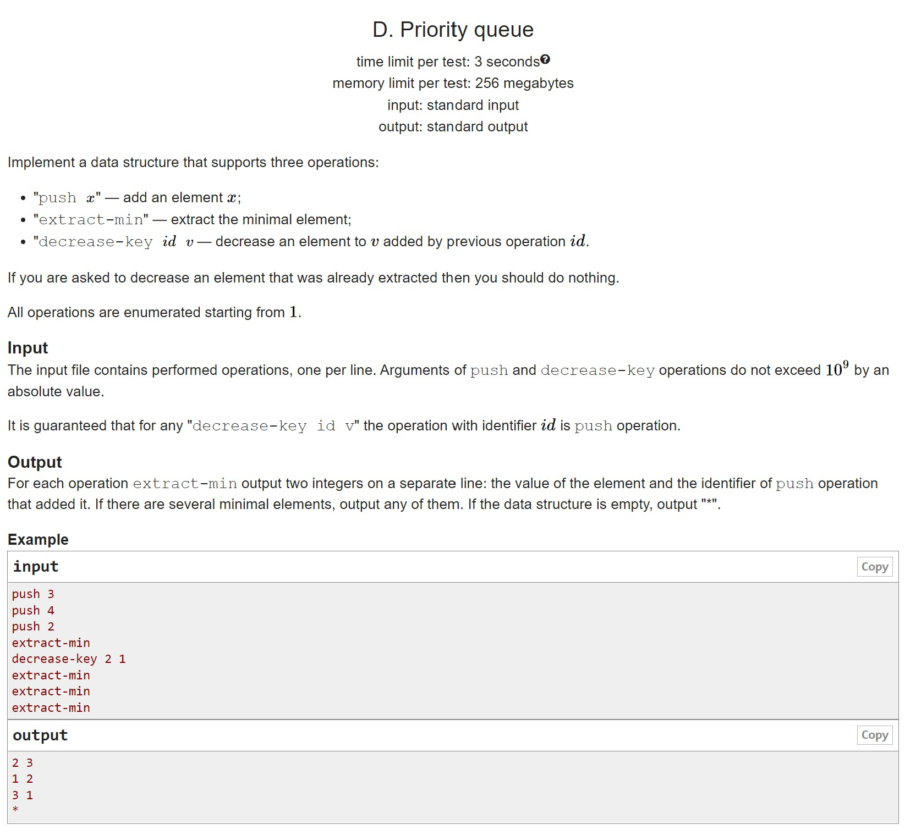

# HW4

A. Minimum on stack Required to use a self-written stack on a linked list (also self-written)

B. Postfix entry This also needs a stack, but this time you can and should implement it on a self-written self-expanding array.

C. Implement a queue It seems like a simple queue, but to be an ace of self-expanding here you need to implement a queue on a self-written self-expanding cyclic array!

D. Priority Queue We use a self-written heap, which can be implemented on a standard self-expanding array. If you really want, you can even use a usual array, because everything should be already clear with self-expanding:)

## A

## B

## C

## D

