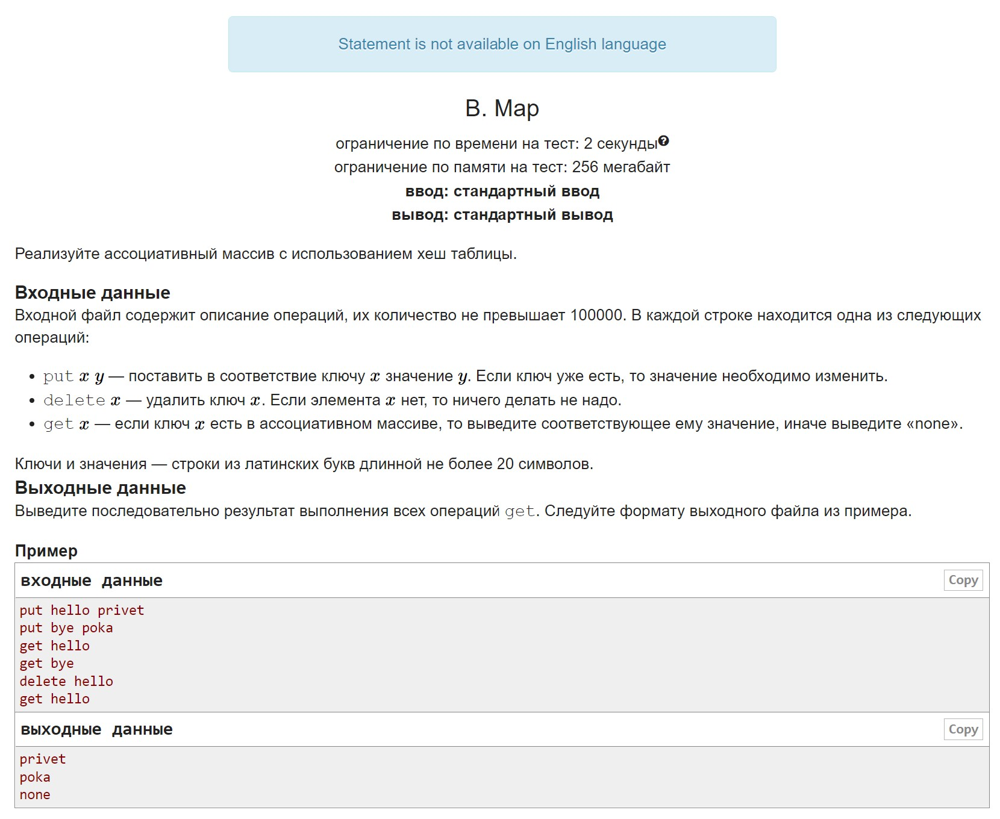
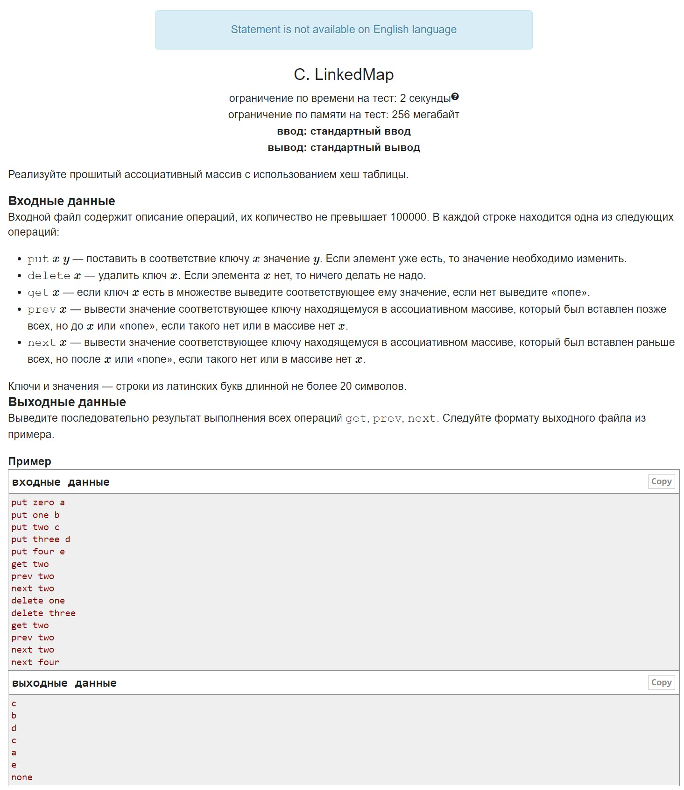

# HW5

A. Set It is required to implement Set on a self-written Hash Table using open addressing.

B. Map It needs Map (logically), resolving collisions using chain method.

C. LinkedMap Not really sure how much of a pain it is to do this by upgrading a hash table with open addressing, so I highly suggest paying attention to the word "Linked" and using the chain method.

D. MultiMap Any collision resolution method you like:)

## A

## B

## C

## D

**TODO**

