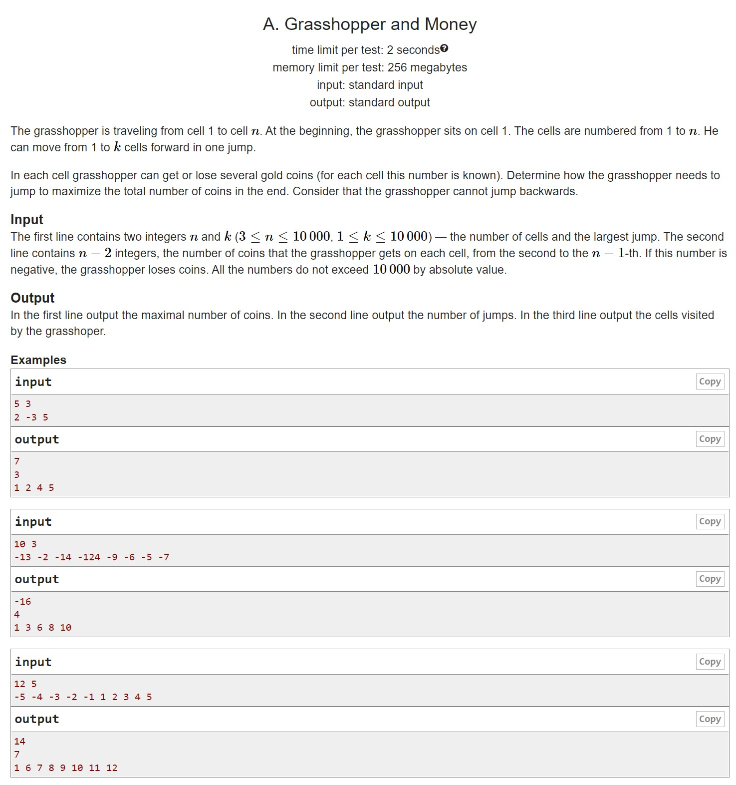
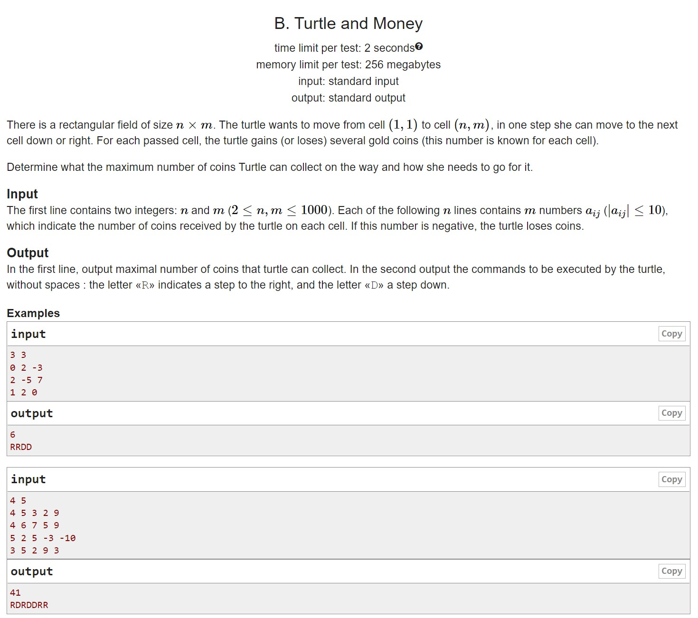
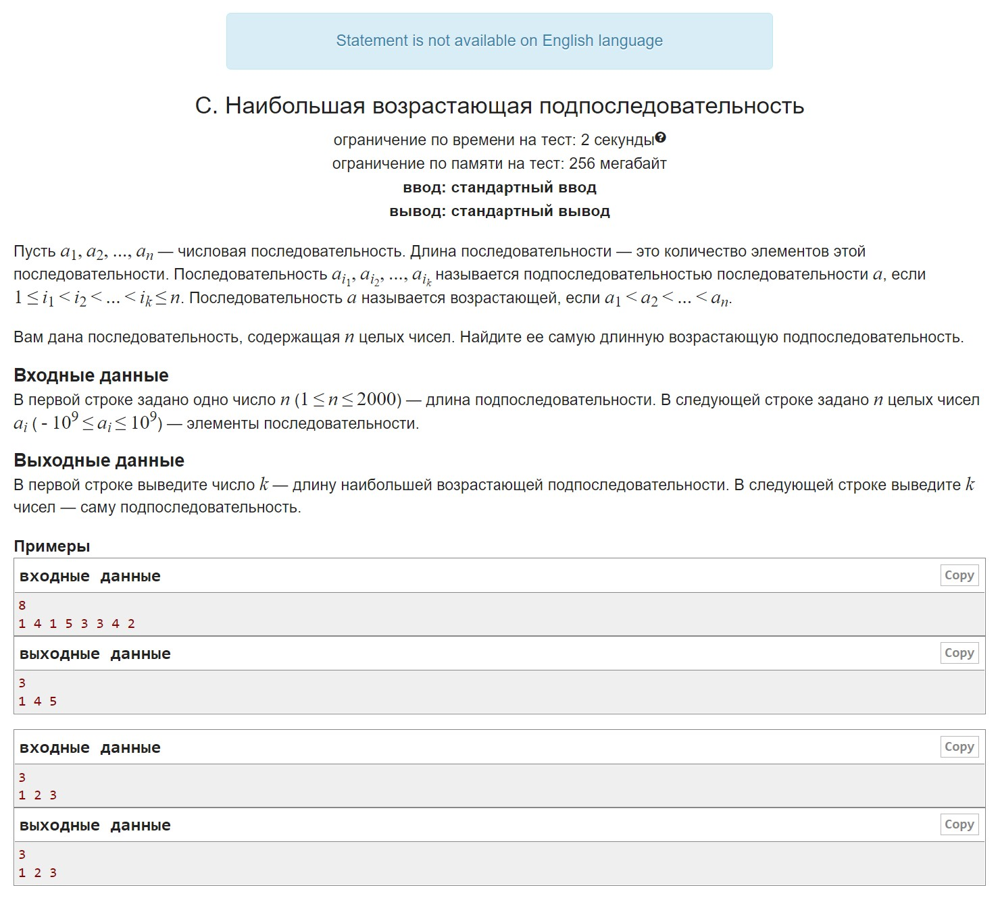
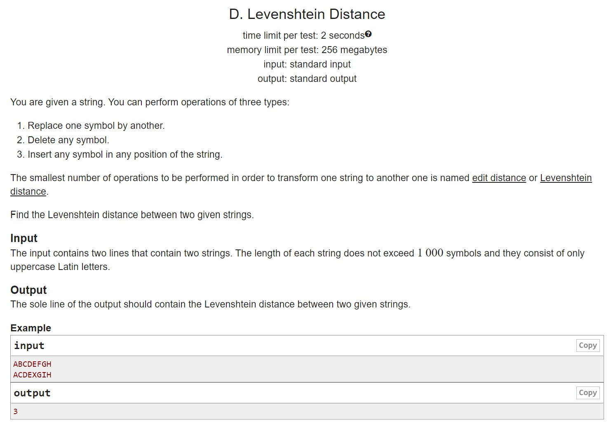
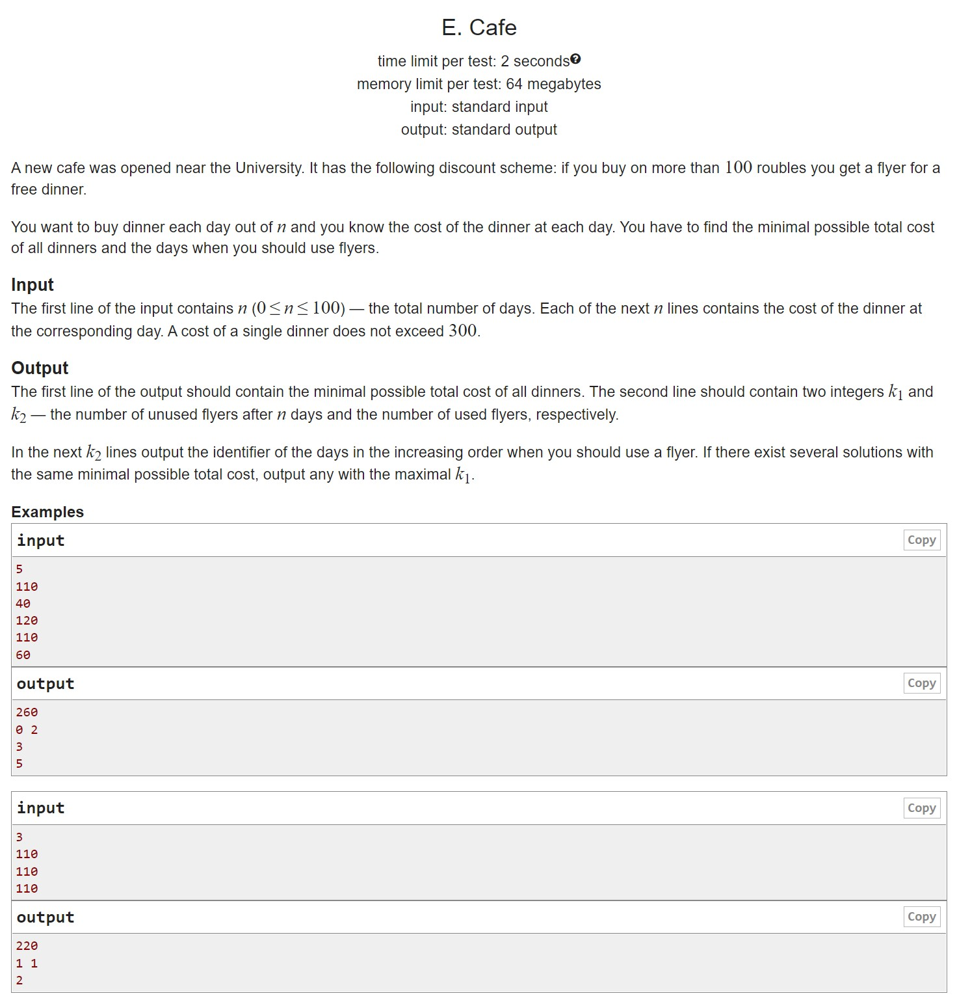

# HW6

A. Grasshopper Collecting Coins Somewhere I've seen a similar problem.
B. The turtle and the coins And I've seen a similar one somewhere
C. The largest increasing subsequence And this one even has a familiar name
D. Levenshtein distance I don't think I've seen this one, but it looks like I have
E. Cafe Oh, and this one is kind of complicated, I'll have to come up with my own solutions, formulas...

## A

## B

## C

## D

## E

