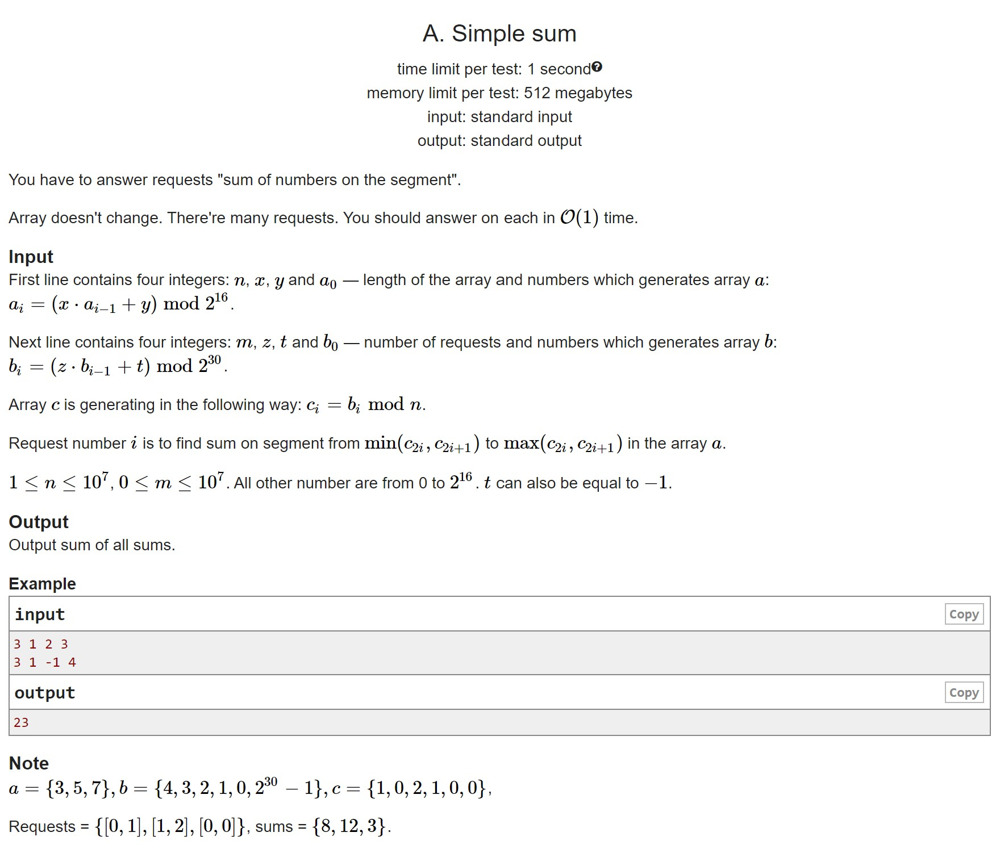
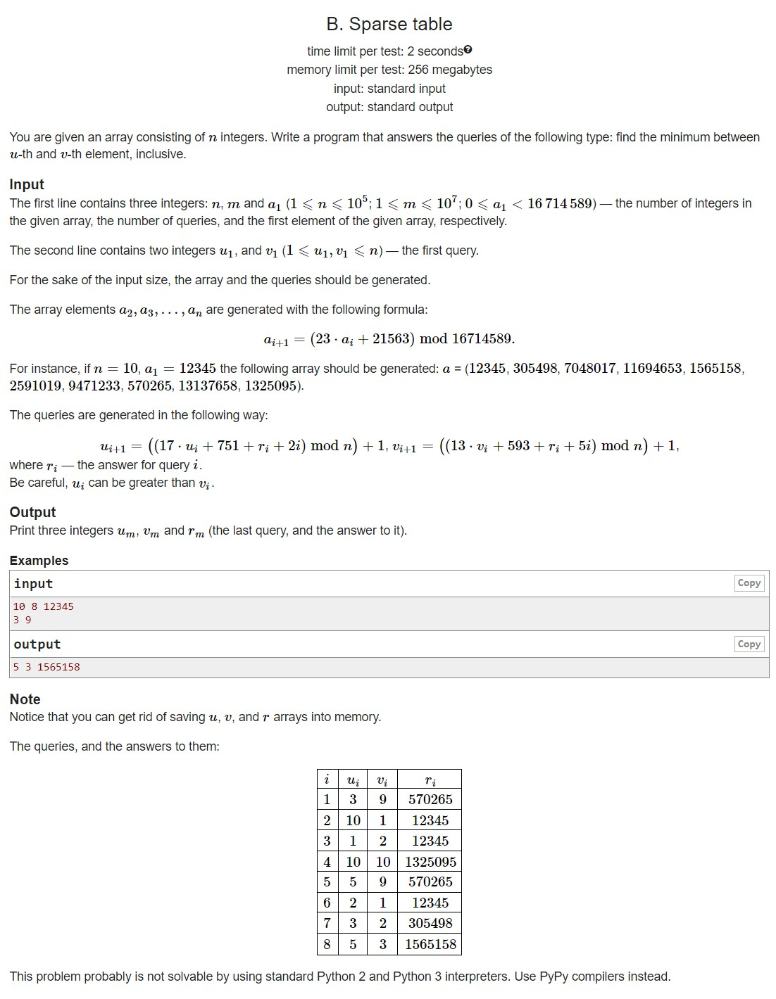
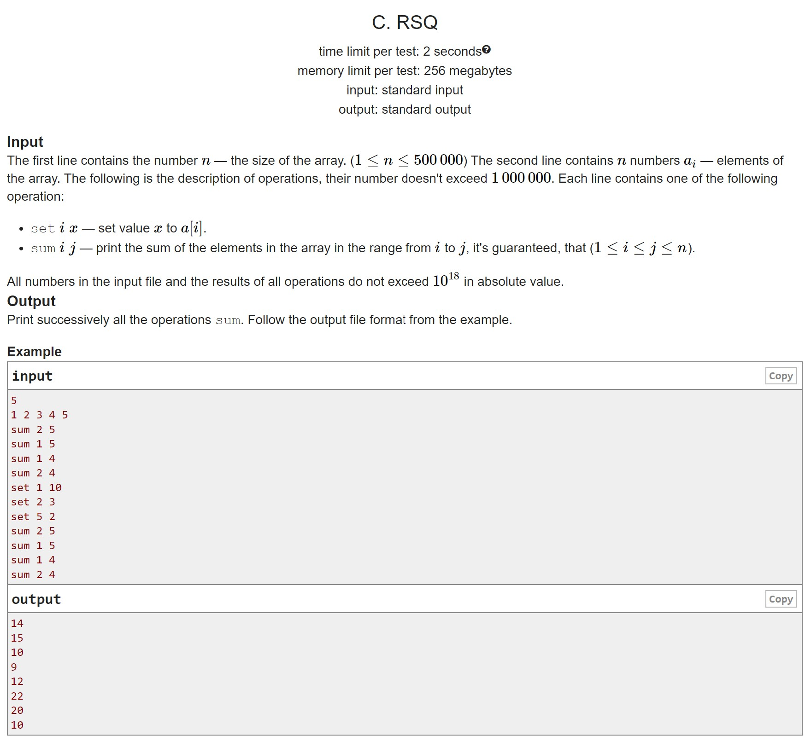
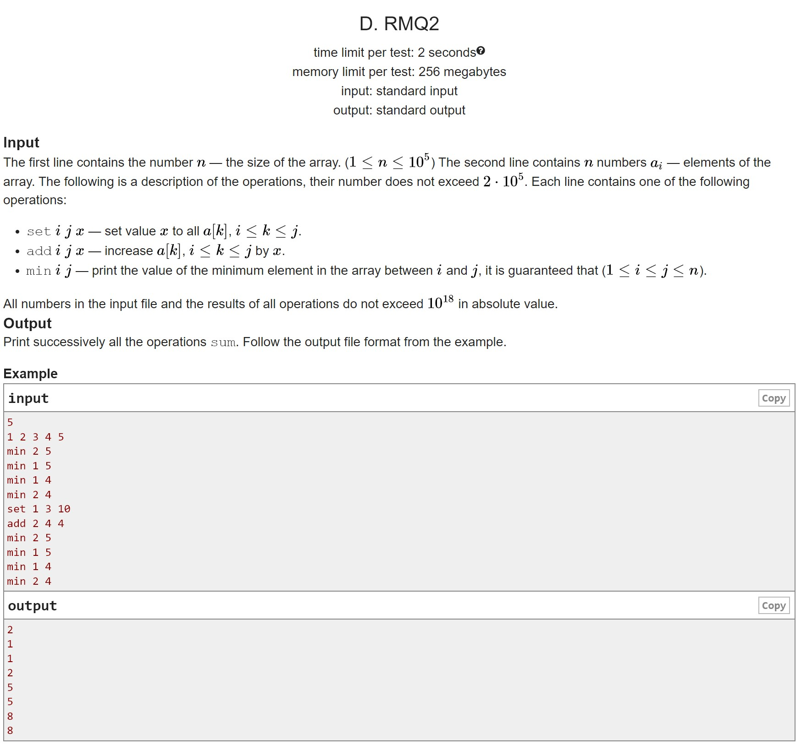
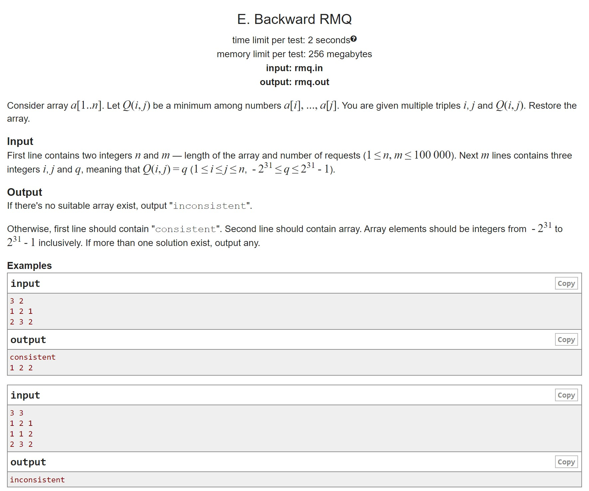

# HW7

A. Simple sum Prefix sums as in lecture

B. Sparse tables Wouldn't you believe it:)

C. RSQ Fenwick's tree is easier to write than a segment tree, and there are simple queries as well

D. RMQ2 We will have to write a segment tree with group operations, non-trivial ones too, we have to think how to "stack" these operations

E. RMQ on the contrary Well, this is just some kind of crap for those who did not have enough fun with the first four:)

## A

## B

## C

## D

## E

