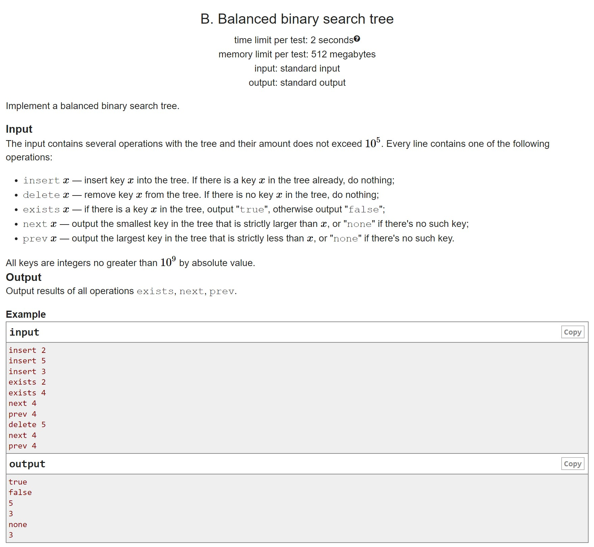
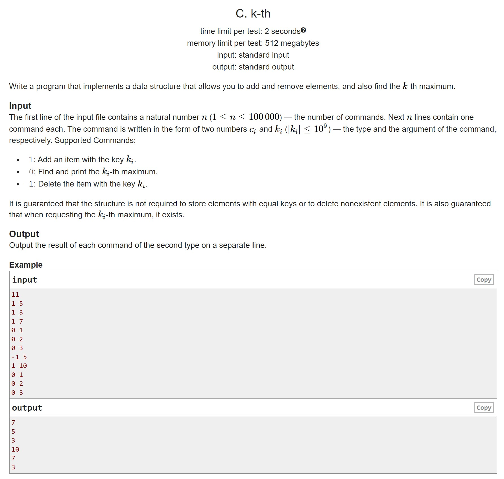
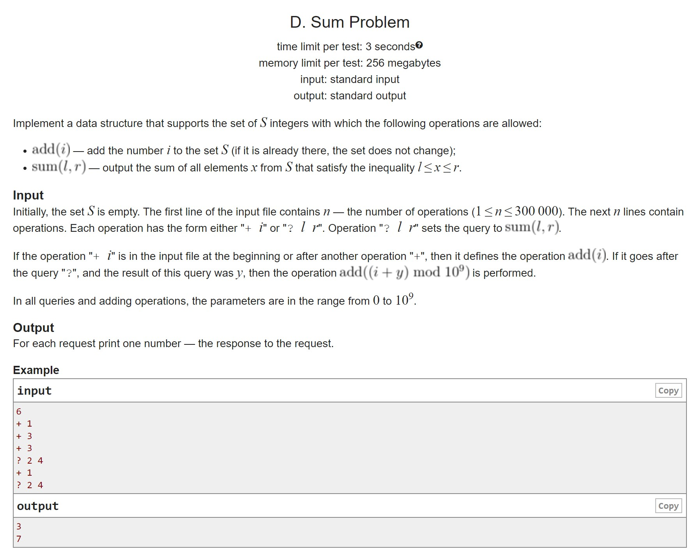

# HW8

A. Simple binary search tree Play around by implementing a normal search tree
B. Balanced binary search tree Implement AVL-tree
C. K-th maximum Here you should remember that you can store supporting information in a vertex, for example, the number of vertices in a subtree:)
D. Again the sum There are no more hints, you have to store a lot of information and think, good toastmaster and the problems are interesting. Once again, let me remind you that you can't do a Cartesian tree (splay in fact too)

## A

## B

## C

## D

