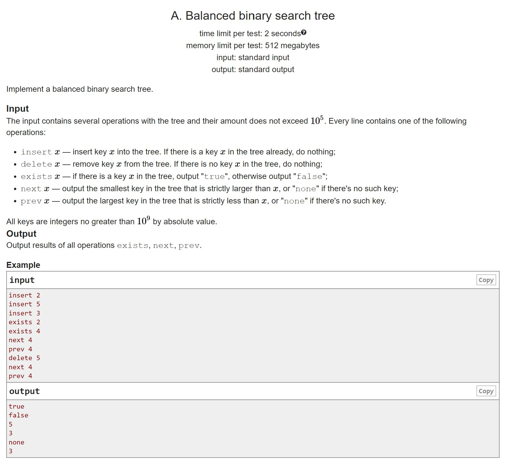
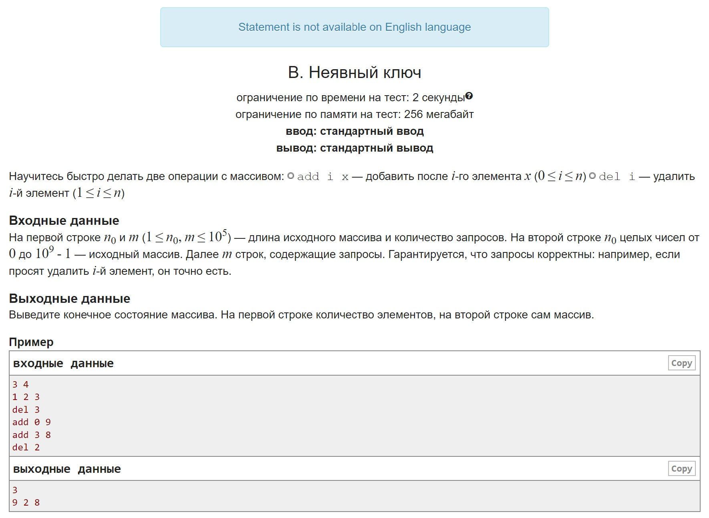
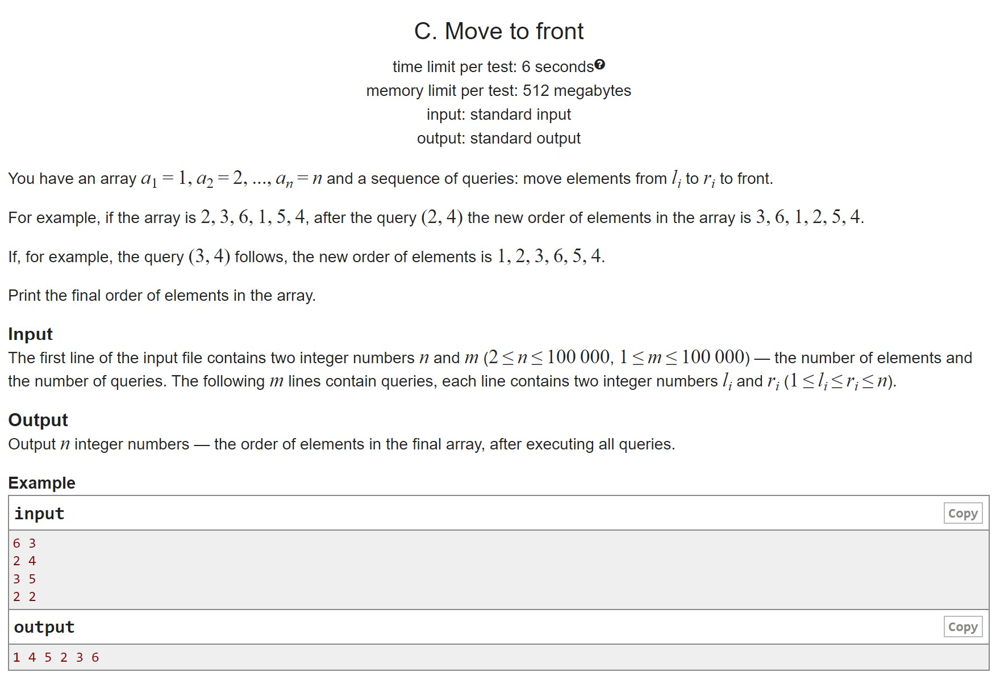
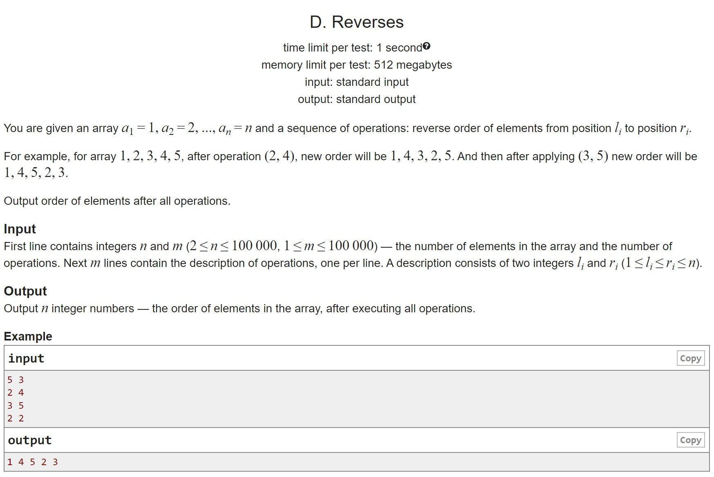

# HW9

A. Balanced binary search tree Implement a Cartesian tree for a familiar problem
B. Implicit key Practice writing an implicit key
C. Move to the beginning It's high time for implicit-key tasks
D. Turns.  And for dessert, the funniest thing the Cartesian tree can do

## A

## B

## C

## D

